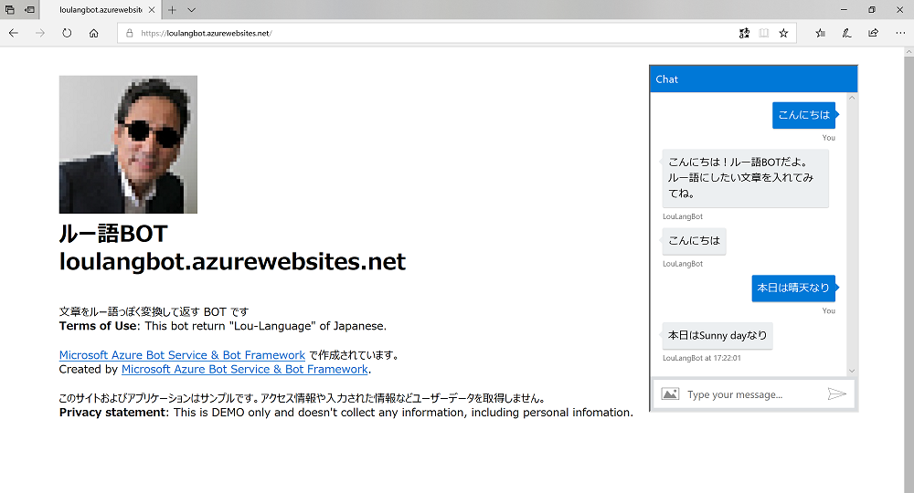

# CognitiveTranslatorAPI-LouLangBot

"Lou" Language Translator Bot | "ルー語" 変換BOT

## Used Technologies
- [Microsoft Bot Framework](https://dev.botframework.com/) V3(C#)
- [Cognitive Services Text Analytics API](https://azure.microsoft.com/ja-jp/services/cognitive-services/text-analytics/)
- [Cognitive Services Translator Text API](https://azure.microsoft.com/ja-jp/services/cognitive-services/translator-text-api/)

## Try
- Try online

https://loulangbot.azurewebsites.net


- Try local with Bot Emulator
Update RootDialig.cs with your API Keys & location on line 17,18,20.

```
static string textAnalyticsSubKey = "YOUR_TEXTANALYTICS_API_KEY"; //update with your Text Analytics API key
static AzureRegions textAnalyticsRegion = AzureRegions.Westus;    //update with your Text Analytics API location
static string translatorSubKey = "YOUR_TRANSLATOR_API_KEY";       //update with your Translator Text API key
```
        

